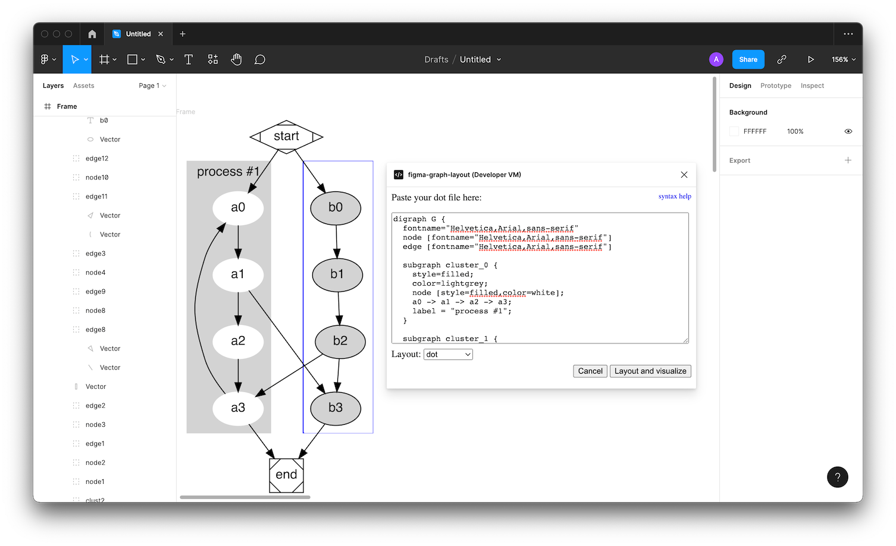

## Graph Layout for Figma

This plugin allows Figma users to insert a `.dot` file and
render it as a graph in the Figma editor.

## License

MIT

# Thanks!

I hope you enjoy the plugin. Feel free to ping me (anvaka@gmail.com or https://twitter.com/anvaka) if
you have any feedback.

You can sponsor my projects [here](https://github.com/sponsors/anvaka) - your funds will be dedicated to more awesome and free data visualizations.

